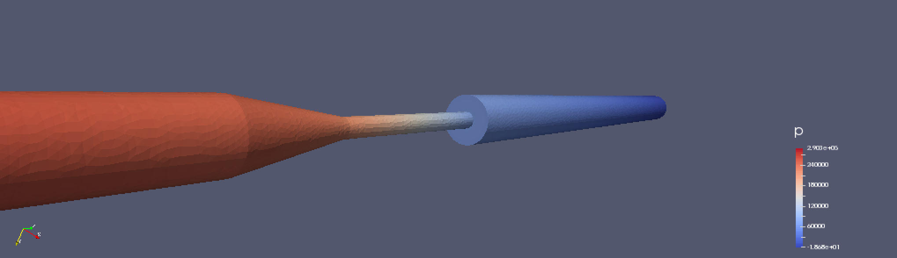

= Navier-Stokes benchmark
Feel++ Consortium <feelpp-devel@feelpp.org>
v1.0, 2015-07-05
:toc:


== Backward step

=== Execute

```shell
# 2D
mpirun -np 16 ./feelpp_steady_ns_2d
# 3D
mpirun -np 16 ./feelpp_steady_ns_3d
```

=== Boundary conditions

Edit the .bc files

== FDA Benchmark

[[img-fda]]
.FDA Device Geometry


=== Purpose

The following is taken from  link:http://www.fda.gov/ScienceResearch/SpecialTopics/CriticalPathInitiative/SpotlightonCPIProjects/ucm149414.htm[Reference documentation].

The purpose of this project is to determine how computational fluid dynamics can be effectively used to characterize fluid flow and to predict blood damage in medical devices. To address this complex issue, FDA has partnered with academia and industry under the Critical Path Initiative program to advance the application of CFD technology in the development and evaluation of medical devices.

=== Application

:numbered:
[bibliography]
=== FDA Bibliography

[bibliography]
- [[[Stewart]]] Stewart, SandyF.C. Paterson, EricG. Burgreen, GregW. Hariharan, Prasanna Giarra, Matthew Reddy, Varun Day, StevenW. Manning, KeefeB. Deutsch, Steven Berman, MichaelR. Myers, MatthewR. Malinauskas, RichardA. 'Assessment of CFD Performance in Simulations of an Idealized Medical Device: Results of FDA’s First Computational Interlaboratory Study'. Cardiovascular Engineering and Technology. June 2012, Volume 3, Issue 2, pp 139-160.
- [[[walsh-muellner]]] 'Validation of an open source framework for the simulation of blood flow in rigid and deformable vessels.''
