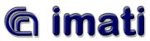
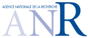
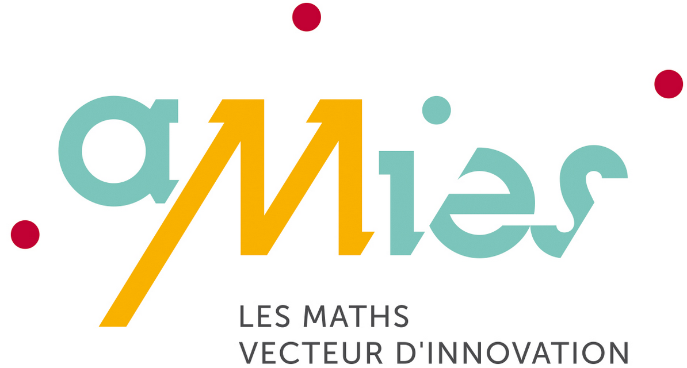
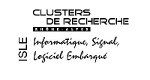
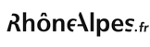

[Feel++](www.feelpp.org) is a unified C++ implementation of Galerkin methods (finite and
spectral element methods) in 1D, 2D And 3D to solve partial
differential equations.   

##Objectives

The objectives of this framework is quite ambitious; ambitions which
could be express in various ways such as :   
- the creation of a versatile mathematical kernel solving easily
  problems using different techniques thus allowing testing and
  comparing methods, e.g. cG versus dG,   
- the creation of a '''small''' and '''manageable''' library which
  shall nevertheless encompass a wide range of numerical methods and
  techniques,   
- build mathematical software that follows closely the mathematical
 abstractions associated with partial differential equations
 (PDE)(which is often not the case, for example the design
 could be physics oriented)  
- the creation of a library entirely in ''C++'' allowing to create
 ''C++'' complex and typically multi-physics applications such as
 fluid-structure interaction or mass transport in
 haemodynamics (the rationale being that these applications
 are computing intensive and the use of an interpreted language such
 as python would not be satisfying though in many simpler cases that
 would simplify and accelerate the development.)   
 
##Organisation of this manual

The user documentation has moved to [GitBook](http://book.feelpp.org).

##Credits

See the [Credits](http://www.feelpp.org/docs/master/Credits.html) page for proper credits attribution.   

##FEEL Consortium

Feel++ was initially developed at École Polytechnique Fédérale de
Lausanne(Suisse) and is now a joint effort between Université de
Strasbourg, Université Joseph Fourier (Grenoble), University of
Coimbra (Portugal), CNRS and [CeMoSiS](http://www.cemosis.fr/).   

<tr>
  <td></td>
  <td></td>
  <td></td>
  <td></td>
  <td></td>
  <td></td>
</tr>

    
 

##Current Sponsors

<tr>
<td></td>
<td></td>
<td></td>
</tr>

##Former Sponsors

<tr>
<td></td>
<td></td>
<td></td>
</tr>

