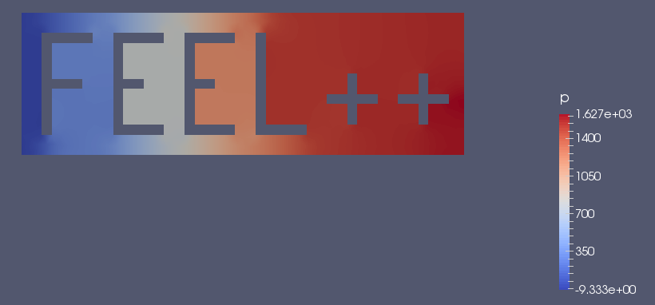
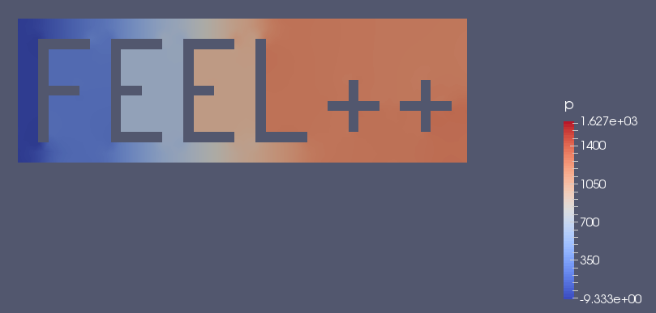

= Backward Differentiation Formula

== General approach
The backward differentiation formula, also abridged BDF, is a set of implicit methods used with ordinary differential equation ( ODE ) for numerical integration. For example, the initial value problem :

$$
y' = f(t,y), \quad y(t_0) = y_0.
$$

can be solved with BDF.

For a given time and function, these methods try to approximate the derivative of this functions, using old computed times data.

The methods, components of BDF, are splitted by their order value. We have then BDF1, BDF2,..., and so on. The general formula can be written as

$$
\sum_{k=0}^s a_k y_{n+k} = h \beta f(t_{n+s}, y_{n+s}) 
$$where s is the order, $$h$$ is the step size and $$t_n = t_0 + nh$$. $$a_k$$ and $$\beta$$ are dependent from order $$s$$, and can be easily found into literature. Here is the two first formula :

$$BDF1:  y_{n+1} - y_n = h f(t_{n+1}, y_{n+1})$$
( This is the backward Euler method )

$$BDF2:  y_{n+2} - \tfrac43 y_{n+1} + \tfrac13 y_n = \tfrac23 h f(t_{n+2}, y_{n+2})$$

== In Feel++

BDF is a subclass derivative from Time-Stepping ( or TS ). It implements, as his name says, backward differentiation formulas up to order $$s\leq 4$$ . As a subclass, BDF share input parameters, which can be set via `ts.{asterisk}`, but have also its own parameters ( such as the order ), define by `bdf.{asterisk}`.

If different time steppers are used simultaneously, you can customize them by adding a prefix like `bdf_options(“myfluid”)`. For example, link:../Models/Fluid/README.adoc[FluidMechanics] offers an interface to this type of case.

Here are some of the main methods from BDF :

|===
|Feel++ Keyword | Description 
|`bdf( _space, _name)` | BDF constructor
|`start( )` | start the bdf at the initial time value
|`isFinished( )` | stop the bdf if the time end is reach
|`next( )` | increment the time by `time.step`
|`next(u)` | increment the time by `u`
|`time( )` | return the current time
|===

=== Example 

==== Code 
In order to illustrate how BDF can be used, we will study quasi-static Navier-Stokes problem. The source code with configuration files can be found in

----
feelpp/quickstart/fluid/navierstokes
----

First at all, as every other problem, we define a mesh and the associated elements. In this case, we will work with Taylor Hood $$P_N+1$$ velocity $$P_N$$  pressure space.

----
auto mesh = loadMesh( new Mesh<Simplex<dim>> );

auto Vh = THch<p_order>( mesh );
auto U = Vh->element();
auto V = Vh->element();
auto u = U.element<0>();
auto v = V.element<0>();
auto p = U.element<1>();
auto q = V.element<1>();

auto deft = gradt( u );
auto def = grad( v );
double mu = doption(_name="mu");
double rho = doption(_name="rho");
----

We define the BDF with `bdf( _space, _name)` and the part of the weak problem $$Ax=f$$. We also add the boundary conditions obtained from the file informed in the configuration file.

----
auto mybdf = bdf( _space=Vh, _name="mybdf" );

auto ft = form1( _test=Vh );

auto a = form2( _trial=Vh, _test=Vh), at = form2( _trial=Vh, _test=Vh);

auto dirichlet_conditions = BoundaryConditionFactory::instance().getVectorFields<dim> ( "velocity", "Dirichlet" );

at.zero();
at+=a;
for( auto const& condition : dirichlet_conditions )
{
  at+=on(_range=markedfaces(mesh,marker(condition)), _rhs=ft, _element=u,
         _expr=expression(condition));
}
----

We can start to use the BDF to create a time loop. In these loops, we fill the bilinear form $$at$$ and the linear one $$ft$$, with time variable.

----
for ( mybdf->start();  mybdf->isFinished() == false; mybdf->next(U) )
    {
        if ( Environment::isMasterRank() )
        {
            std::cout << "------------------------------------------------------------\n";
            std::cout << "Time " << mybdf->time() << "s\n";
        }
        auto bdf_poly = mybdf->polyDeriv();
        auto rhsu =  bdf_poly.element<0>();
        auto extrap = mybdf->poly();
        auto extrapu = extrap.element<0>();
        // add BDF term to the right hand side from previous time steps
        ft = integrate( _range=elements(mesh), _expr=rho*(trans(idv(rhsu))*id(u) ) );
        toc("update rhs");tic();

        at.zero();
        at += a;
        at += integrate( _range=elements( mesh ), _expr= rho*trans(gradt(u)*idv(extrapu))*id(v) );
        for( auto const& condition : dirichlet_conditions )
        {
            at+=on(_range=markedfaces(mesh,marker(condition)), _rhs=ft, _element=u,
                   _expr=expression(condition));
        }
        toc("update lhs");tic();

        if ( soption("ns.preconditioner") != "petsc" )
        {
            a_blockns->update( at.matrixPtr(), rho*idv(extrapu), dirichlet_conditions );
           
----

With the two parts completed, we can solve the problem at the time t.

----       
at.solveb(_rhs=ft,_solution=U,_backend=backend(_name="ns"),_prec=a_blockns);
        }
        else
        {
            // use petsc preconditioner
            at.solveb(_rhs=ft,_solution=U,_backend=backend(_name="ns"));
        }
        toc("solve");tic();
----

Then the results are exported at the time t, in order to observe them change over time.
----
        w.on( _range=elements(mesh), _expr=curlv(u) );
        e->step(mybdf->time())->add( "u", u );
        e->step(mybdf->time())->add( "w", w );
        e->step(mybdf->time())->add( "p", p );
        //e->step(mybdf->time())->addScalar( "mean_p", f_mean(p) );
        e->save();
        toc("export");
        toc("time step");

    }
----

===== Results

We decide to launch the previous code with a $$t_{init}=10$$, $$t_{max}=10$$ and a time step  $$\Delta_t=0.1$$, that's give us 100 time iterations in our BDF loop.
Here are some results from Paraview :

[[imgBDFt0]]
.Results at time $$t=0$$ ( initial value )

[[imgBDFt0]]
.Results at time $$t=3.5$$ ( iteration 34 )

