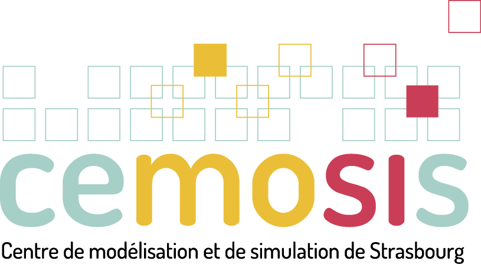

FEEL++ Consortium
=================

Feel++ was initially developed at École Polytechnique Fédérale de
Lausanne(Suisse) and is now a joint effort between Université de
Strasbourg, Université Joseph Fourier (Grenoble), University of
Coimbra (Portugal), CNRS and http://www.cemosis.fr[Cemosis].

 

