= Post-Processing and Visualization
:toc:
:toc-placement: macro
:toclevels: 2

toc::[]

== Introduction

Once the PDE is solved we usually would like to
visualize the solution and possibly other data or fields associated with the problem. Feel++ provides a very powerful framework for  post-processing allowing to:

  * visualize time-based data,
  
  * visualize high order functions,
  
  * visualize traces,
  
  * use standard visualization tools such as Paraview, Ensight and Gmsh.

To achieve this, Feel++ defines a so-called `Exporter`  object.

==  General principles

The library Feel itself does not have any visualization capabilities. However, it provides tools to export both scalar and
vector fields into two formats: `EnSight`  and `Gmsh.`  The EnSight format   can be read by the visualization software http://www.ensight.com[EnSight]  or, for instance, by the open source package http://www.paraview.org[Paraview].

The choice of format depends on several factors, some of them being  the robustness/capabilities of the visualization packages associated  and the type of data to be plotted.

For first (at most second) degree piecewise polynomials defined in straight edge/faces meshes, Paraview (or any other software that  reads the EnSight format) is a very good choice. A trick to use   Paraview (or any other visualization software that plots first order  geometrical and finite elements) to visualize high degree polynomials in curved meshes, is to use an interpolation operator built on high order nodes associated with the polynomial space,  see~\cite gpena_cprudhomme_acomen. However, for high degree  polynomials or meshes with curved elements, http://geuz.org/gmsh[Gmsh] is prefered due to its adaptive visualization algorithm for this type of finite/geometrical element.

To illustrate both approaches in visualizing high degree polynomials in curved meshes, we plot, in the Figures below, the nodal  projection of the function $$f(x,y)=\cos(5x) \sin(5y)$$ in the  unit circle onto several function spaces. Notice the improved
``look`` of the projection using high degree polynomials instead of linear projections in a finer mesh. We remark also that the difference between the two approaches fades away as we increase the  degree of the polynomials and the order of the geometrical elements. However, the additional cost of building the piecewise first order finite element space associated with the finer mesh, the  calculation of the projection onto this space and the smoothness of the graphics makes Gmsh's approach more appealing to visualize this type of finite elements. We highlight that these algorithms are available for meshes composed only of simplices or quadrilaterals (see \ref Notations), in 1D, 2D and 3D.

.Comparison between various geometrical interpolation order
|===
| Order 1 | Order 2 | P2isoP1| Order 3 | P3isoP1 | Order 4 | P4isoP1 | Order 5 | P5isoP1
|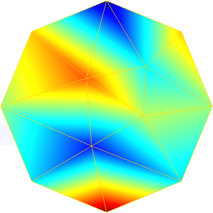
|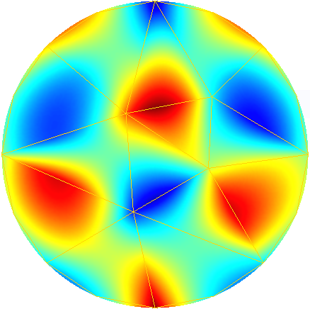 
|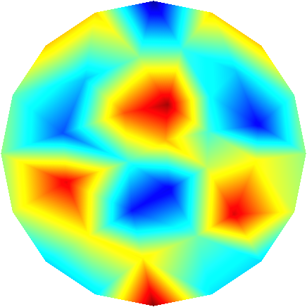
|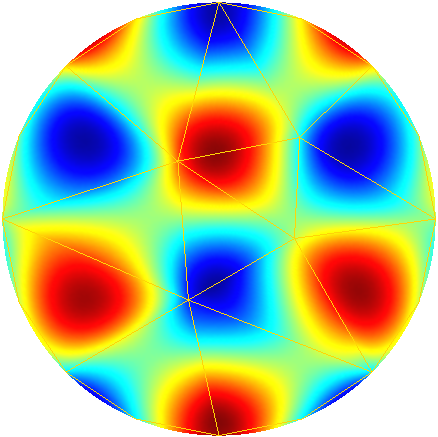
| 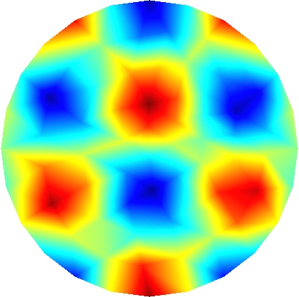
| 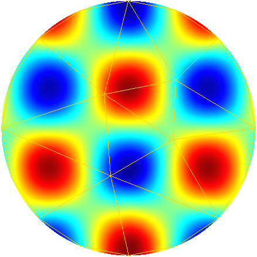 
| 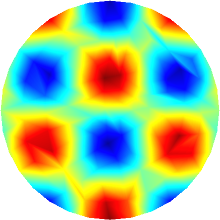 
| 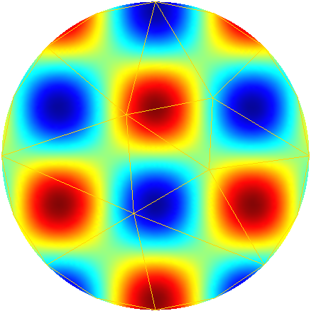 
| 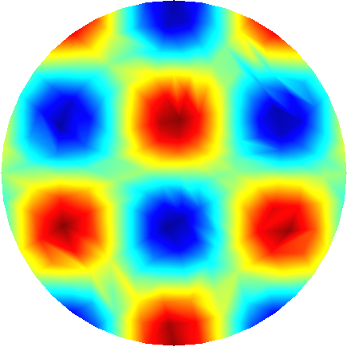
|===

To further illustrate the capabilities of the Feel's exporter to Gmsh, we plot in Figures 1D and 3D functions defined on the unit sphere.

.Visualisation of a function using geometrical 1 to 4 in 3D
|===
|Order 1 | Order 2 | Order 3 | Order 4 
| 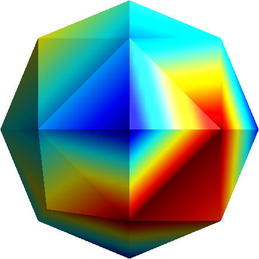
| 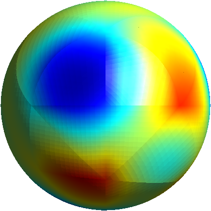 
| 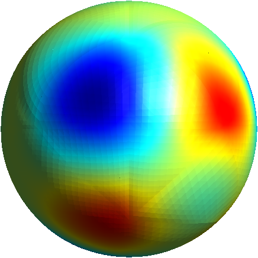 
| 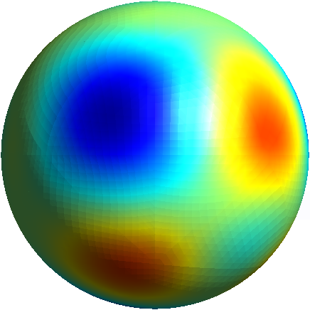
|===

== Visualization

We would like to visualize the function $$u=\sin(\pi x)$$ over 
$$\Omega= \{ (x,y) \in \mathbb{R}^2 | x^2 + y^2 < 1 \} $$
$$\Omega$$ is approximated by $$\Omega_h$$.

To define $$\Omega$$ and $$u$$ the code reads mesh

[source,cpp,indent=0]
----

----

We start with an `Exporter`  object that allows to visualize the $$P_1$$ interpolant of $$u$$ over $$\Omega$$.

== ExporterReference Reference

=== Options

`exporter.format`

  * Type: multiple choice `string`
  
  * Values: `gmsh` , `ensight` , `ensightgold`
  
  * Default value: ensightgold
  
  * Action: `exporter.format`  defines the format to save Feel++ data into.

`exporter.geometry`

  * Type: multiple choice `string`
  
  * Values: `change_coords_only` , `change` , `static`
  
  * Default value: change_coords_only
  
  * Action: `exporter.geometry`  tells to the exporter if the mesh   changes over time steps : no changes (`static)` coordinates     only (`change_coords_only)`  or remeshed (`changes)`

`exporter.fileset`

  * Type: `bool`
  
  * Values: `0`, `1`
  
  * Default value: `0`
  
  * Action: `exporter.fileset`=0 save one file per timestep per subdomain,  whereas `exporter.fileset`=1 use one file per subdomain to store all time steps.
  
> This option, `exporter.fileset`=1, reduces tremendously the number of files generated for transient simulations.

`exporter.prefix`

  * Type: `string`
  
  * Default Value: `<empty string>`
  
  * Action: `exporter.prefix`  defines the prefix to be user by the exporter. It is especially useful when using multiple exporters and avoid name collision.

`exporter.directory`

  * Type: `string`
  
  * Default Value: results
  
  * Action: `exporter.directory` tells where to export the results 

==== Ensight Gold specific options 

`exporter.ensightgold.use` -sos

  * Type: `bool`
  
  * Action: if `exporter.ensightgold.use` -sos=0 multiple case files are handle in first case file else the sos file is used to handle multiple case files

`exporter.ensightgold.save` -face

  * Type: `bool`
  
  * Action: if `exporter.ensightgold.save` -face=1, the exporter saves mesh and fields on marked faces
