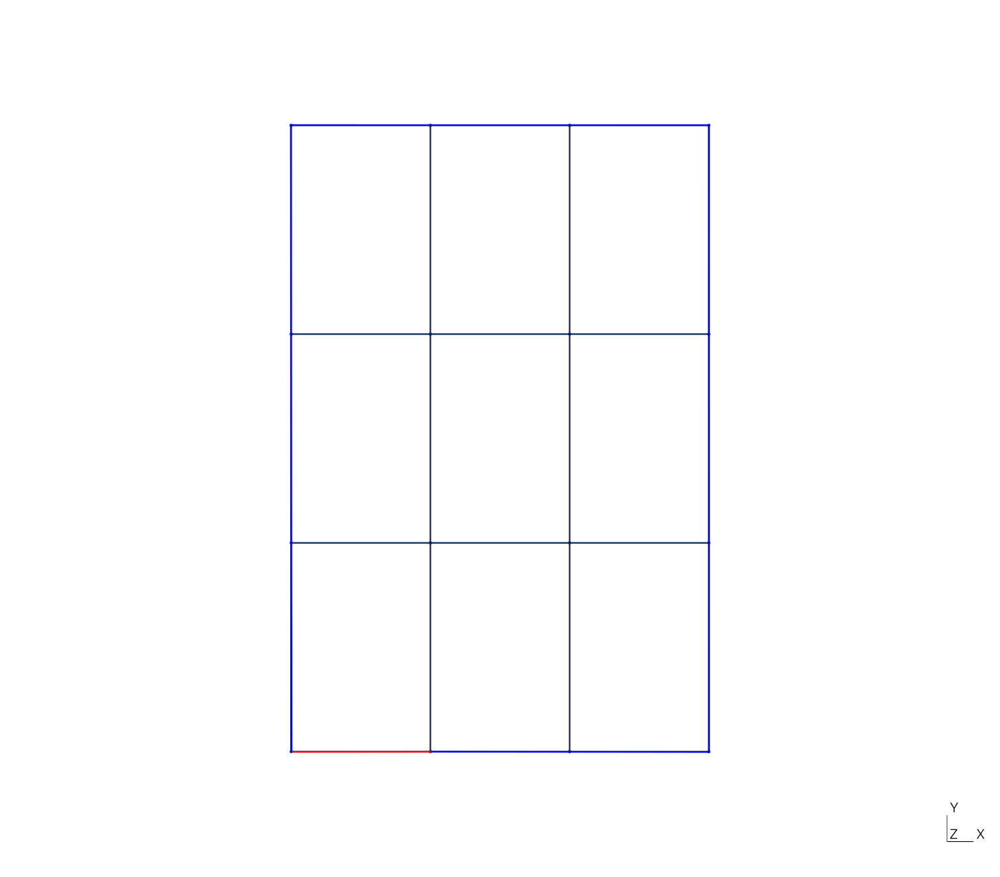

:feelpp: Feel++
= case_generator_cube
Christophe Prud'homme <https://github.com/prudhomm[@prudhomm]>; Vincent Chabannes <https://github.com/vincentchabannes[@vincentchabannes]>; Thomas Saigre <https://github.com/thomas-saigre[@thomas-saigre]>; Ali Elarif <https://github.com/alielarif/[@alielarif]>
:manmanual: case_generator_cube
:case: cube
:man-linkstyle: pass:[blue R < >]
stem: latexmath

== NAME

{manmanual} - a tool to generate configuration files for the case `{case}` with {feelpp}.

== SYNOPSIS

`python3 {manmanual} [OPTIONS]`

== REQUIREMENT

To run the Python script, you need to install the https://pypi.org/project/python-liquid[`python-liquid`] library.

== DESCRIPTION

`{manmanual}` is an application which generates

* a geometry associted to the case described below,
* the JSON model file associated,
* the config file to run the toolbox mor on this case, or the toolbox heat,
* the JSON CRB model file associated.

=== Options

{manmanual} requires some options.

.Table of command-line {manmanual} options
|===
| Name | Description | Default value

| `-h`, `--help` | show help message and exit |
| `--Nv NV`      | number of fins in vertical direction | 3
| `--Nh NH`      | number of fins in horizontal direction  | 3
| `--Nd ND`      | number of fins in depth direction  | 1
| `--L L`        | width of a cube | 1
| `--height H`   | height of a cube | 1
| `--d D`        | depth of a cube (for 3D only) | 1
| `--dim DIM`    | dimension of the case (2 or 3) | 2
| `--odir ODIR`  | output directory | `.`
|===

== Description of the case and the parameters

.Description of the geometry

Here are the parameters that stans for both 2D and 3D cases.

* stem:[N_v] is the vertical number of cubes in the geometry (here, stem:[N_v=2]),
* stem:[N_h] is the horizontal number of cubes in the geometry (here, stem:[N_h=3]),
// * stem:[N_d] is the depth number of cubes in the geometry (here, stem:[N_d=1]), *note :* at this time, only stem:[N_d=1] is supported
* stem:[L] is the length of it,
* stem:[h] is the height of it,
* stem:[d] is the depth

Here are some example of geometry generated with the script.

.2D case, stem:[N_v=3], stem:[N_h=3], stem:[L=1], stem:[h=1]

.2D case, stem:[N_v=3], stem:[N_h=3], stem:[L=1], stem:[h=1.5]

.3D case, stem:[N_v=3], stem:[N_h=3], stem:[L=1], stem:[h=1.5], stem:[d=2]
image::fig/3d.png[3D]

== SEE ALSO

*{feelpp} Book:* http://docs.feelpp.org

== COPYING

Copyright \(C) 2017-2023 {feelpp} Consortium. +
Free use of this software is granted under the terms of the GPLv3 License.
