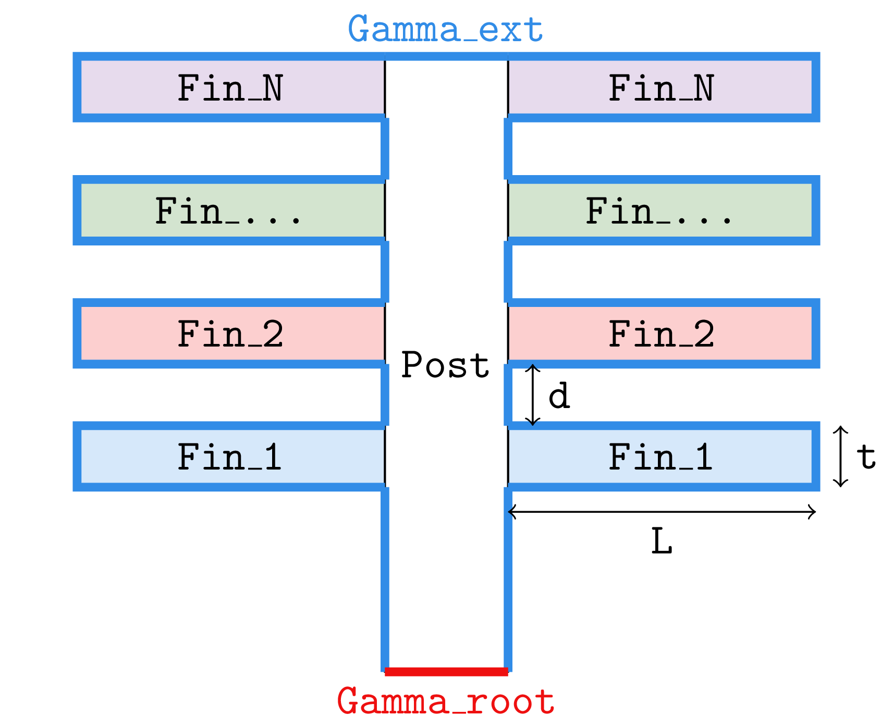

:feelpp: Feel++
= feelpp_mesh_exporter(1)
Christophe Prud'homme <https://github.com/prudhomm[@prudhomm]>; Vincent Chabannes <https://github.com/vincentchabannes[@vincentchabannes]>; Thomas Saigre <https://github.com/thomas-saigre[@thomas-saigre]>
:manmanual: feelpp_case_generator
:tf:
:man-linkstyle: pass:[blue R < >]

== NAME

{manmanual} - a tool to generate configuration files for the case {tf} with {feelpp}.

== SYNOPSIS

`{manmanual} [OPTIONS]`

== ReQUIREMENT

To run the Python script, you need to install the https://pypi.org/project/python-liquid[`python-liquid`] library.

== DESCRIPTION

`{manmanual}` is an application which generates

* a geometry associted to the case described below
* the JSON model file associated
* the config file to run the toolbox mor on this case, or the toolbox heat.

=== Options

{manmanual} requires some options.

.Table of command-line {manmanual} options
|===
| Name | Description | Default value

| `-h`, `--help`        | show help message and exit |
|  `--N N`              | number of fins |  4
|  `--L L`              | width of a fin | 2.5
|  `--d D`              | distance between two fins | 0.5
|  `--t T`              | thickness of a fin | 0.25
|  `--dim DIM`          | dimension of the case (2 or 3) |  2
| `--cylinder CYLINDER` | shape of fin and post (0=boxes, 1=box/cylinders, 2=cylinders) | 0
| `--odir PATH`         | output directory | `.`
|===

== Description of the case and the parameters

Here are the parameters that stans for both 2D and 3D cases.

* stem:[N] is the number of fins in the geometry (here, stem:[N=4]),
* stem:[L] is the width of a fin,
* stem:[t] is the height of it,
* stem:[d] is the distance between two fins

The following parameters are specific to the 3D case :

* `cylinder` : set the shape of the central _post_ and of the fins :
|===
| value | Description

| `0`     | Post and fins are boxes
| `1`     | Post is a box and the fins are cylinders of radius `t` (so the parameter `P` is not used here)
| `2`     | Post and fins are cylinders of raduis `t`
|===

== SEE ALSO

*{feelpp} Book:* http://docs.feelpp.org

== COPYING

Copyright \(C) 2017-2021 {feelpp} Consortium. +
Free use of this software is granted under the terms of the GPLv3 License.
